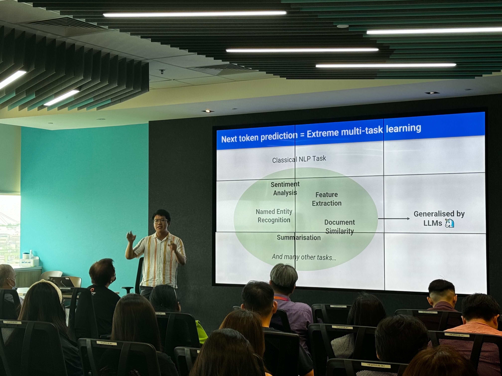

# Working with LLMs: A Data Analyst’s Guide

> This blog post summarizes a talk I gave at GovTech's Data Science and AI Connect, a regular gathering of practitioners and enthusiasts across Singapore's public service. Below are some key points and reflections from my presentation.



# Key Points

- **LLMs as Calculators for Open-Ended Tasks:**
    - Instead of viewing LLMs as advanced autocompletes, think of them as calculators for open-ended tasks.
    - Just as you'd use a calculator for complex arithmetic, LLMs can handle tasks like extracting last names from a list or classifying restaurant reviews as positive or negative.

- **Understanding the Tokenizer:**
    - For technical audiences, I emphasized the importance of understanding the tokenizer and its quirks. As Andrej Karpathy notes, many limitations of LLMs stem from the tokenizer.

- **Developments in Data Analysis:**
    - I categorized advancements into LLMs that write code and those that write and execute code. The latter can rewrite code based on results or errors, making them more agentic.
    - Text2SQL is popular with models like [Defog.ai](https://huggingface.co/defog) and [Pandas AI](https://github.com/Sinaptik-AI/pandas-ai).
    - I demoed ChatGPT's code interpreter, a feature I believe is underappreciated. While not perfect, it has great potential to empower domain experts and speed up insights and decision-making.

- **LLMs in Classical Machine Learning:**
    - LLMs significantly reduce the time needed to deploy an initial prototype. Ship the application quickly and improve it over time with collected data.

- **Practical Tips:**
    - Adjust `max_tokens` and `logit_bias` parameters to use LLMs as zero/few-shot classifiers that return confidence scores.
    - Use LLMs to generate additional features (columns) and examples (rows).
    - Embedding models, though not technically LLMs, can be used out-of-the-box for initial prototypes in text classification tasks.

- **Resources for Getting Started:**
    - I concluded with resources on how to begin utilizing LLMs (Slides 23 to 26).

# Slides

```{=html}
<iframe src="https://docs.google.com/presentation/d/e/2PACX-1vSlA53p5TOUpMbbTszsZx4Z3lh805WDp02ib2tw9O3IT1IAqmV4BH67RVWbXoSySRa5i_6y10ODrToK/embed?start=false&loop=false&delayms=3000" frameborder="0" width="600" height="356" allowfullscreen="true" mozallowfullscreen="true" webkitallowfullscreen="true"></iframe>

